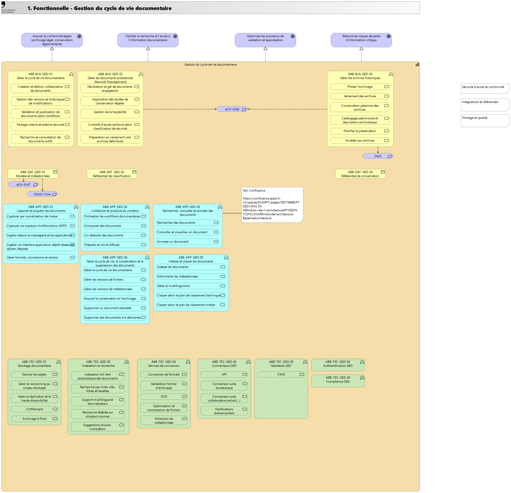

# Gestion du cycle de vie documentaire
**Intention**

Capacité à produire, classifier, valider, diffuser, archiver et détruire les documents institutionnels tout au long de leur cycle de vie, en garantissant leur intégrité, traçabilité et conformité légale. Couvre les documents structurés et non structurés, papier et numériques.  Éléments clés  - Création et capture de documents (production, numérisation, import) - Classification et indexation selon plan de classement métier - Gestion des métadonnées documentaires - Workflow de validation et d'approbation - Gestion des versions et des révisions - Contrôle d'accès et droits de consultation - Distribution et diffusion contrôlée - Gestion de la durée de conservation (calendrier de conservation) - Gestion hybride papier/numérique

## Bénéfices attendus

- Assurer la conformité légale (archivage légal, conservation réglementaire)

- Faciliter la recherche et l'accès à l'information documentaire

- Optimiser les processus de validation et approbation

- Réduire les risques de perte d'information critique

## ABB Techniques

### Indexation et recherche
Fournit les capacités d'indexation full-text et de recherche rapide sur contenus et métadonnées. Supporte la recherche multilingue (FR, DE, IT) et les facettes avancées.

|Propriété|Valeur|
|-|-|
|Transversalité du besoin||
|Complexité métier||
|Business criticality||
|Compliance||

**Services attendus**

- Indexation full-text automatique des documents

- Recherche par mots-clés, filtres et facettes

- Support multilingue et lemmatisation

- Recherche fédérée sur plusieurs sources

- Suggestions et auto-complétion

### Services de conversion
Gère la conversion de formats documentaires, la génération de PDF/A pour archivage et l'extraction de texte (OCR). Assure la pérennité des formats et l'accessibilité des documents.

|Propriété|Valeur|
|-|-|
|Transversalité du besoin||
|Complexité métier||
|Business criticality||
|Compliance||

**Services attendus**

- Conversion de formats

- Génération format d'archivage

- OCR

- Optimisation et compression de fichiers

- Extraction de métadonnées

### Stockage documentaire
Assure la persistance physique des documents et de leurs versions sur infrastructures redondantes et sécurisées. Implémente les stratégies de sauvegarde, réplication et archivage à froid.  Support multi-locataires (cloud public, cloud privé, on-premise).

|Propriété|Valeur|
|-|-|
|Transversalité du besoin||
|Complexité métier||
|Business criticality||
|Compliance||

**Services attendus**

- Stocker les objets

- Gérer le versionning au niveau stockage

- Gérer la réplication et la haute disponibilité

- Chiffrement

- Archivage à froid

### Connecteurs GED
Expose les services GED via API REST sécurisées et gère les connecteurs vers systèmes tiers (Office 365, e-mail, ERP, plateformes métier).  Assure l'interopérabilité et l'intégration dans l'écosystème SI cantonal.

|Propriété|Valeur|
|-|-|
|Transversalité du besoin||
|Complexité métier||
|Business criticality||
|Compliance||

**Services attendus**

- API

- Connecteur suite bureautique

- Connecteur suite collaborative (emails...)

- Notifications évènementiels

### Standards GED
- Titre - Documentation - Liste de services - Standards métiers (services de l'ABB technique "Standards") - Transversalibilité du besoin - Complexité métier - Compliance

|Propriété|Valeur|
|-|-|
|Transversalité du besoin||
|Complexité métier||
|Business criticality||
|Compliance||

**Services attendus**

- CMIS

### Authentification GED
- Titre - Documentation - Standards métiers (services de l'ABB technique "Standards") - Transversalibilité du besoin - Complexité métier - Business criticality - Compliance

|Propriété|Valeur|
|-|-|
|Transversalité du besoin||
|Complexité métier||
|Business criticality||
|Compliance||

**Services attendus**

### Compliance GED
- Titre - Documentation - Standards métiers (services de l'ABB technique "Standards") - Transversalibilité du besoin - Complexité business logic - Business criticality - Compliance

|Propriété|Valeur|
|-|-|
|Transversalité du besoin||
|Complexité métier||
|Business criticality||
|Compliance||

**Services attendus**

