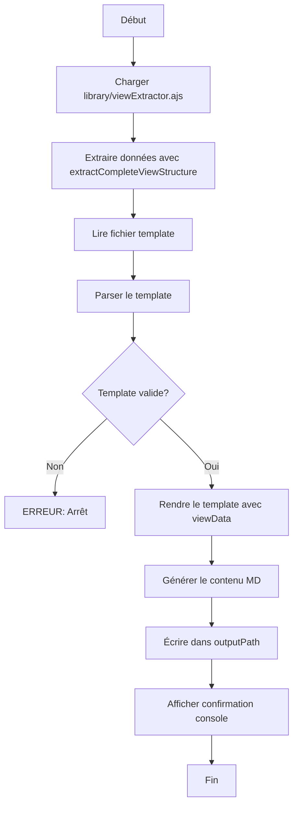

# Spécifications - Script de Rendu de Template Markdown

## Vue d'ensemble

Ce script génère un fichier Markdown en appliquant un template Jinja-like sur les données extraites d'une vue ArchiMate via `viewExtractor.ajs`.

### Contexte

- **Environnement**: jArchi (Nashorn JavaScript)
- **Dépendances**: `library/viewExtractor.ajs`
- **Syntaxe template**: Inspirée de Jinja (voir [JINJA_REFERENCE.md](JINJA_REFERENCE.md))
- **Fichier**: `Tools/extractMD/templateRenderer.ajs`

## Signature de la fonction

```javascript
/**
 * Génère un fichier Markdown en appliquant un template sur une vue ArchiMate
 *
 * @param {object} view - La vue ArchiMate (objet jArchi)
 * @param {string} templatePath - Chemin absolu vers le fichier template (.md)
 * @param {string} outputPath - Chemin absolu vers le fichier de sortie (.md)
 * @throws {Error} Si le template est mal formé ou les fichiers inaccessibles
 */
function renderTemplate(view, templatePath, outputPath)
```

## Flux d'exécution



## Étapes détaillées

### 1. Chargement des dépendances

```javascript
// Charger la bibliothèque d'extraction
load(__DIR__ + "../library/viewExtractor.ajs");
```

### 2. Extraction des données de la vue

```javascript
var viewData = extractCompleteViewStructure(view);
```

**Structure de viewData**:
```javascript
{
    view: {
        id: "...",
        name: "...",
        documentation: "...",
        type: "...",
        properties: { ... }
    },
    elements: [
        {
            id: "...",
            type: "...",
            name: "...",
            documentation: "...",
            bounds: { x, y, width, height },
            style: { fillColor, fontColor, ... },
            isGroup: true/false,
            isNote: true/false,
            isElement: true/false,
            concept: { id, name, type, documentation, properties },
            properties: { ... },
            visualParentId: "...",
            visualParent: { ... },
            visualChildren: [ ... ],
            visualChildrenIds: [ ... ],
            allProperties: { ... }
        },
        // ...
    ],
    relationships: [
        {
            id: "...",
            type: "...",
            name: "...",
            documentation: "...",
            sourceId: "...",
            targetId: "...",
            source: { ... },  // Référence à l'élément source
            target: { ... },  // Référence à l'élément cible
            style: { ... },
            properties: { ... },
            concept: { ... },
            allProperties: { ... }
        },
        // ...
    ],
    visualContainment: [
        {
            type: "visual-containment",
            source: "parentId",
            target: "childId",
            sourceElement: { ... },
            targetElement: { ... }
        },
        // ...
    ]
}
```

### 3. Lecture du template

```javascript
var templateContent = readFile(templatePath);
```

**Format du template**: Fichier texte Markdown avec syntaxe Jinja-like

### 4. Parsing du template

Le parser doit identifier et extraire:
- **Variables**: `{{ variable.property }}`
- **Boucles**: `...`
- **Conditionnelles**: `.........`
- **Commentaires**: `{# commentaire #}` (ignorés)
- **Filtres**: `{{ variable|filter }}` ou `{{ variable|filter(param) }}`

**Validation**:
- Toutes les balises `` doivent avoir un ``
- Toutes les balises `` doivent avoir un ``
- Pas de balises non fermées
- Syntaxe des expressions valide

**En cas d'erreur de parsing**: Lever une exception avec message explicite

### 5. Rendu du template

#### 5.1 Variables

**Syntaxe**: `{{ expression }}`

**Exemples**:
```jinja
{{ view.name }}
{{ element.type }}
{{ element.concept.documentation }}
{{ element.properties.Statut }}
```

**Résolution**:
1. Parser l'expression (ex: `element.properties.Statut`)
2. Naviguer dans l'objet viewData pour récupérer la valeur
3. Si la variable/propriété n'existe pas:
   - Afficher un warning orange dans la console: `[WARNING] Variable non trouvée: element.properties.Statut`
   - Remplacer par chaîne vide `""`

**Contexte**: Les variables accessibles dépendent du scope actuel (global ou dans une boucle)

#### 5.2 Boucles (for)

**Syntaxe**: `...`

**Exemples**:
```jinja

- {{ element.name }}



{{ rel.source.name }} -> {{ rel.target.name }}

```

**Comportement**:
1. Évaluer `collection` dans le contexte courant
2. Pour chaque élément de la collection:
   - Créer un nouveau contexte avec `variable` = élément courant
   - Ajouter les variables `loop.*`:
     - `loop.index` - Index (commence à 1)
     - `loop.index0` - Index (commence à 0)
     - `loop.first` - true si premier élément
     - `loop.last` - true si dernier élément
     - `loop.length` - Nombre total d'éléments
   - Rendre le contenu de la boucle
3. Concaténer tous les résultats

**Boucles imbriquées**:
```jinja

  
    - {{ child.name }}
  

```
Chaque boucle a son propre contexte et son propre objet `loop`

#### 5.3 Conditionnelles (if)

**Syntaxe**:
```jinja

...

...

...

```

**Exemples**:
```jinja

**Doc**: {{ element.documentation }}



Type: Capacité

Type: Processus

Type: {{ element.type }}

```

**Opérateurs supportés**:
- Comparaison: `==`, `!=`, `<`, `>`, `<=`, `>=`
- Logiques: `and`, `or`, `not`
- Appartenance: `in` (ex: `"text" in element.name`)

**Évaluation**:
- Valeurs "falsy": `false`, `null`, `undefined`, `""`, `0`, `[]` (liste vide)
- Toutes les autres valeurs sont "truthy"

#### 5.4 Filtres

**Syntaxe**: `{{ variable|filter }}` ou `{{ variable|filter(param) }}`

**Filtres de base à implémenter**:

| Filtre | Description | Exemple |
|--------|-------------|---------|
| `upper` | Convertir en majuscules | `{{ name\|upper }}` |
| `lower` | Convertir en minuscules | `{{ name\|lower }}` |
| `capitalize` | Première lettre en majuscule | `{{ name\|capitalize }}` |
| `title` | Chaque mot commence par une majuscule | `{{ name\|title }}` |
| `length` | Longueur d'une liste ou chaîne | `{{ elements\|length }}` |
| `first` | Premier élément d'une liste | `{{ elements\|first }}` |
| `last` | Dernier élément d'une liste | `{{ elements\|last }}` |
| `default(value)` | Valeur par défaut si vide | `{{ doc\|default("N/A") }}` |
| `replace(old, new)` | Remplacer une chaîne | `{{ name\|replace(" ", "_") }}` |
| `trim` | Supprimer espaces début/fin | `{{ text\|trim }}` |
| `escape` | Échapper caractères Markdown | `{{ text\|escape }}` |
| `join(sep)` | Joindre une liste | `{{ items\|join(", ") }}` |

**Chaînage de filtres**:
```jinja
{{ element.name|lower|replace(" ", "_") }}
```
Appliqué de gauche à droite

#### 5.5 Tests

**Syntaxe**: `variable is test` ou `variable is not test`

**Tests à implémenter**:

| Test | Description | Exemple |
|------|-------------|---------|
| `defined` | Variable existe | `` |
| `empty` | Vide (null, "", []) | `` |
| `even` | Nombre pair | `` |
| `odd` | Nombre impair | `` |

#### 5.6 Commentaires

**Syntaxe**: `{# commentaire #}`

**Comportement**: Ignorés complètement lors du rendu (ne produisent aucune sortie)

```jinja
{# Ceci est un commentaire et ne sera pas rendu #}
{{ view.name }}
```

#### 5.7 Contrôle des espaces blancs

**Syntaxe**: `-` dans les balises d'instruction

- `` - Supprime les espaces blancs **après** la balise

**Comportement**:
- `` : Supprime les espaces/retours à la ligne qui précèdent la balise
- `` : Supprime les espaces/retours à la ligne qui suivent la balise
- `` : Supprime des deux côtés

**Exemple sans contrôle** (génère des lignes vides):
```jinja

- {{ item.name }}

```
Produit:
```markdown

- Item 1

- Item 2

```

**Exemple avec contrôle** (pas de lignes vides):
```jinja

- {{ item.name }}

```
Produit:
```markdown
- Item 1
- Item 2
```

**Important pour les tableaux** :
```jinja
| Colonne1 | Colonne2 |
|----------|----------|

| {{ item.name }} | {{ item.value }} |

```

Sans le `-%}`, chaque ligne du tableau serait séparée par une ligne vide, **cassant le format Markdown du tableau**.

### 6. Formatage automatique du Markdown

#### 6.1 Vigilance sur le format Markdown

**IMPORTANT** : Le rendu doit produire un Markdown valide et bien formé.

##### 6.1.1 Tableaux Markdown

Les tableaux sont particulièrement sensibles au formatage. Un tableau Markdown valide doit respecter ces règles :

**✅ Format correct** :
```markdown
| Colonne1 | Colonne2 |
|----------|----------|
| Valeur1  | Valeur2  |
| Valeur3  | Valeur4  |
```

**❌ Formats incorrects** :

1. **Lignes vides entre les lignes du tableau** (casse le tableau) :
```markdown
| Colonne1 | Colonne2 |
|----------|----------|

| Valeur1  | Valeur2  |

| Valeur3  | Valeur4  |
```

2. **Retours à la ligne dans les cellules** (casse le tableau) :
```markdown
| Colonne1 | Colonne2 |
|----------|----------|
| Valeur
avec retour | Valeur2  |
```

**Solutions** :

1. **Utiliser le contrôle des espaces blancs** avec `-%}` :
```jinja

| {{ item.col1 }} | {{ item.col2 }} |

```

2. **Remplacer les retours à la ligne par `<br>`** dans les cellules :
```jinja

| {{ item.col1|replace("\n", "<br>") }} | {{ item.col2 }} |

```

3. **Échapper le caractère pipe** `|` dans les valeurs :
```jinja
| {{ item.name|escape }} | {{ item.value|escape }} |
```

##### 6.1.2 Autres éléments Markdown

- **Listes** : Pas de ligne vide entre les items (sauf pour les listes imbriquées)
- **Titres** : Ligne vide avant et après recommandée
- **Paragraphes** : Séparés par une ligne vide
- **Code** : Délimiteurs ` ``` ` sur des lignes séparées

#### 6.2 Échappement dans les tableaux

Dans les cellules de tableaux Markdown, certains caractères doivent être échappés:
- `|` → `\|`
- Nouveaux lignes → `<br>`

**Détection**: Si le contexte est dans une ligne contenant `|...|...|`, appliquer l'échappement

Le filtre `escape` peut être utilisé pour cela :
```jinja
| {{ element.name|escape }} | {{ element.documentation|escape }} |
```

#### 6.3 Préservation de l'indentation

L'indentation du template est préservée dans la sortie.

### 7. Export de l'image de la vue (optionnel)

**Fonctionnalité**: Exporter automatiquement une image PNG de la vue dans le même répertoire que le fichier MD.

**API jArchi**: `$.model.renderViewToFile(view, filepath, format, options)`

**Implémentation**:

```javascript
/**
 * Export view as PNG image
 * @param {object} view - ArchiMate view
 * @param {string} outputPath - Path to MD file
 * @returns {string} Relative path to image file
 */
function exportViewImage(view, outputPath) {
    try {
        // Determine image filename based on output path
        var mdFileName = outputPath.substring(outputPath.lastIndexOf("/") + 1);
        var baseName = mdFileName.replace(/\.md$/i, "");
        var imageFileName = baseName + ".png";

        // Get output directory
        var lastSlash = outputPath.lastIndexOf("/");
        var outputDir = lastSlash > 0 ? outputPath.substring(0, lastSlash) : ".";
        var imagePath = outputDir + "/" + imageFileName;

        // Export options
        var options = {
            margin: 10,      // Margin in pixels
            scale: 1         // Scale factor (1 = 100%)
        };

        // Export view to PNG
        $.model.renderViewToFile(view, imagePath, "PNG", options);

        console.log("View image exported: " + imagePath);

        // Return relative path for markdown
        return imageFileName;

    } catch (e) {
        logWarning("Cannot export view image: " + e.message);
        return null;
    }
}
```

**Utilisation dans le template**:

Le chemin de l'image est automatiquement ajouté au contexte :

```javascript
var context = createRootContext(viewData);
context.viewImagePath = exportViewImage(view, outputPath);
```

**Template**:

```jinja
# {{ view.name }}





{{ view.documentation }}
```

**Options d'export**:
- `margin` : Marge autour de la vue en pixels (défaut: 10)
- `scale` : Facteur d'échelle (1 = 100%, 2 = 200%, etc.)
- Format supporté : PNG (SVG possible avec `"SVG"`)

**Note**: L'export d'image est optionnel. Si l'export échoue, un warning est affiché mais le rendu du MD continue.

### 8. Écriture du fichier de sortie

```javascript
writeFile(outputPath, renderedContent);
```

### 9. Messages console

#### Messages de succès (vert)
```
=== Template Rendering ===
View: "Nom de la Vue"
Template: /path/to/template.md
Output: /path/to/output.md
Rendered successfully (1234 lines)
======================
```

#### Warnings (orange)
```
[WARNING] Variable non trouvée: element.properties.StatutInconnu (ligne 15)
[WARNING] Propriété manquante: element.conceptInexistant.name (ligne 23)
```

#### Erreurs (rouge - arrêt du script)
```
[ERROR] Template mal formé:  sans  (ligne 42)
[ERROR] Impossible de lire le fichier template: /path/to/template.md
[ERROR] Erreur d'écriture du fichier: /path/to/output.md
```

## Gestion des erreurs

### Erreurs fatales (exception levée)

1. **Fichier template introuvable**
   - Message: `"Template file not found: " + templatePath`

2. **Template mal formé**
   - Message: `"Template syntax error at line X: " + détails`
   - Exemples:
     - Balise non fermée: `{% for ... }` sans ``
     - Syntaxe invalide: ``
     - Balises imbriquées incorrectement

3. **Erreur d'écriture du fichier**
   - Message: `"Cannot write output file: " + outputPath`

4. **Vue invalide**
   - Message: `"Invalid view object"`

### Warnings (non bloquants)

1. **Variable inexistante**
   - Console: `[WARNING] Variable non trouvée: element.property`
   - Comportement: Remplacer par `""`

2. **Propriété manquante**
   - Console: `[WARNING] Propriété manquante: element.properties.XXX`
   - Comportement: Remplacer par `""`

3. **Filtre appliqué sur mauvais type**
   - Console: `[WARNING] Filtre 'length' ne peut pas être appliqué sur: number`
   - Comportement: Retourner la valeur originale

## Structure du code

### Modules recommandés

```javascript
// ===========================
// Template Renderer
// ===========================

/**
 * Fonction principale
 */
function renderTemplate(view, templatePath, outputPath) {
    // 1. Charger viewExtractor
    // 2. Extraire données
    // 3. Lire template
    // 4. Parser template
    // 5. Rendre template
    // 6. Écrire fichier
}

/**
 * Lecture d'un fichier texte
 */
function readFile(filePath) {
    // Java File I/O
}

/**
 * Écriture d'un fichier texte
 */
function writeFile(filePath, content) {
    // Java File I/O
}

/**
 * Parser le template en AST (Abstract Syntax Tree)
 */
function parseTemplate(templateContent) {
    // Retourne un arbre de tokens
}

/**
 * Tokenizer - découpe le template en tokens
 */
function tokenize(templateContent) {
    // Retourne: [
    //   { type: "text", value: "..." },
    //   { type: "variable", value: "view.name" },
    //   { type: "for", variable: "element", collection: "elements" },
    //   ...
    // ]
}

/**
 * Rendre un template parsé
 */
function render(ast, context) {
    // Parcourt l'AST et génère le contenu
}

/**
 * Évaluer une expression dans un contexte
 */
function evaluateExpression(expression, context) {
    // Ex: "element.properties.Statut" -> valeur
}

/**
 * Évaluer une condition
 */
function evaluateCondition(condition, context) {
    // Ex: "element.type == 'business-capability'" -> true/false
}

/**
 * Appliquer un filtre
 */
function applyFilter(value, filterName, filterArgs) {
    // Ex: applyFilter("hello", "upper", []) -> "HELLO"
}

/**
 * Appliquer un test
 */
function applyTest(value, testName) {
    // Ex: applyTest(myVar, "defined") -> true/false
}

/**
 * Afficher un warning dans la console (orange)
 */
function logWarning(message) {
    console.log("\x1b[33m[WARNING]\x1b[0m " + message);
}

/**
 * Lever une erreur
 */
function throwError(message) {
    console.log("\x1b[31m[ERROR]\x1b[0m " + message);
    throw new Error(message);
}
```

## Exemples d'utilisation

### Exemple 1: Script appelant simple

```javascript
// monScript.ajs
load(__DIR__ + "Tools/extractMD/templateRenderer.ajs");

var view = selection.filter("archimate-diagram-model").first();
var templatePath = __DIR__ + "templates/rapport.md";
var outputPath = __DIR__ + "output/rapport_genere.md";

renderTemplate(view, templatePath, outputPath);
```

### Exemple 2: Traitement de plusieurs vues

```javascript
load(__DIR__ + "Tools/extractMD/templateRenderer.ajs");

var views = $("view");
var templatePath = __DIR__ + "templates/standard.md";

views.each(function(view) {
    var outputPath = __DIR__ + "output/" + view.name + ".md";
    renderTemplate(view, templatePath, outputPath);
});
```

## Tests recommandés

### Cas de test

1. **Template simple avec variables**
   - Template: `# {{ view.name }}\n{{ view.documentation }}`
   - Vérifier: Rendu correct

2. **Boucle simple**
   - Template: `{{ el.name }}\n`
   - Vérifier: Tous les éléments listés

3. **Boucles imbriquées**
   - Vérifier: Contexte correct pour chaque niveau

4. **Conditionnelles**
   - Template avec if/elif/else
   - Vérifier: Branches correctes

5. **Filtres**
   - Tester chaque filtre individuellement
   - Tester chaînage

6. **Variables manquantes**
   - Vérifier: Warning affiché + chaîne vide

7. **Template mal formé**
   - Boucle non fermée → Erreur
   - Syntaxe invalide → Erreur

8. **Propriétés personnalisées**
   - `{{ element.properties.MaPropriete }}`
   - Vérifier: Accès correct

9. **Tableaux Markdown**
   - Vérifier: Pas de lignes vides entre les lignes du tableau
   - Vérifier: Pas de retours à la ligne dans les cellules
   - Vérifier: Échappement `|` avec filtre `escape`
   - Vérifier: Utilisation correcte de `-%}` dans les boucles

10. **Vue sans éléments**
    - Vérifier: Pas d'erreur, boucles produisent contenu vide

## Contraintes techniques

### Environnement Nashorn

- **Pas de ES6**: Utiliser `var`, pas `let`/`const`
- **Pas de template literals**: Utiliser concaténation de chaînes
- **Pas de méthodes ES6**: Pas de `Array.find()`, `Array.includes()`, etc.
- **Regex**: Supporté (utiliser pour parsing)

### Performance

- Optimiser pour vues avec jusqu'à **500 éléments**
- Parsing du template: Fait une seule fois
- Éviter les boucles O(n²) si possible

### Compatibilité

- Chemin Windows: `C:\Users\...` et Unix: `/home/...`
- Utiliser `Java.type("java.io.File")` pour I/O
- Encodage UTF-8 pour lecture/écriture

## Extensions futures possibles

(Non implémentées dans v1, mais à prévoir dans l'architecture)

1. **Filtres personnalisés**: Permettre d'ajouter des filtres custom
2. **Macros**: Réutiliser des blocs de template
3. **Include**: Inclure d'autres templates
4. **Set**: Définir des variables dans le template
5. **Import de fonctions**: Charger des helpers JavaScript

## Références

- [JINJA_REFERENCE.md](JINJA_REFERENCE.md) - Syntaxe Jinja supportée
- [library/viewExtractor.ajs](../../library/viewExtractor.ajs) - Extraction des données
- Documentation Jinja originale: https://jinja.palletsprojects.com/
