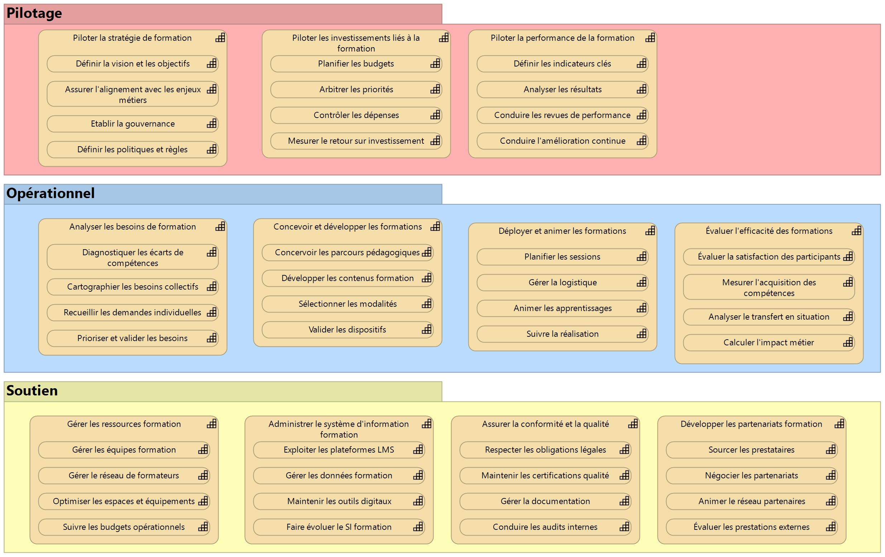

# Capacité de Gestion de la Formation

## Pilotage

### Piloter la stratégie de formation

#### Définir la vision et les objectifs

#### Assurer l'alignement avec les enjeux métiers

#### Etablir la gouvernance

#### Définir les politiques et règles

### Piloter les investissements liés à la formation

#### Planifier les budgets

#### Arbitrer les priorités

#### Contrôler les dépenses

#### Mesurer le retour sur investissement

### Piloter la performance de la formation

#### Définir les indicateurs clés

#### Analyser les résultats

#### Conduire les revues de performance

#### Conduire l'amélioration continue

## Opérationnel

### Analyser les besoins de formation

#### Diagnostiquer les écarts de compétences

#### Cartographier les besoins collectifs

#### Recueillir les demandes individuelles

#### Prioriser et valider les besoins

### Concevoir et développer les formations

#### Concervoir les parcours pédagogiques

#### Développer les contenus formation

#### Sélectionner les modalités d'apprentissage

#### Valider les dispositifs

### Déployer et animer les formations

#### Planifier les sessions

#### Gérer la logistique

#### Animer les apprentissages

#### Suivre la réalisation

### Évaluer l'efficacité des formations

#### Évaluer la satisfaction des participants

#### Mesurer l'acquisition des compétences

#### Analyser le transfert en situation

#### Calculer l'impact métier

## Soutien

### Gérer les ressources formation

#### Gérer les équipes formation

#### Gérer le réseau de formateurs

#### Optimiser les espaces et équipements

#### Suivre les budgets opérationnels

### Administrer le système d'information formation

#### Exploiter les plateformes LMS

#### Gérer les données formation

#### Maintenir les outils digitaux

#### Faire évoluer le SI formation

### Développer les partenariats formation

#### Sourcer les prestataires

#### Négocier les partenariats

#### Animer le réseau partenaires

#### Évaluer les prestations externes

### Assurer la conformité et la qualité

#### Respecter les obligations légales

#### Maintenir les certifications qualité

#### Gérer la documentation

#### Conduire les audits internes

