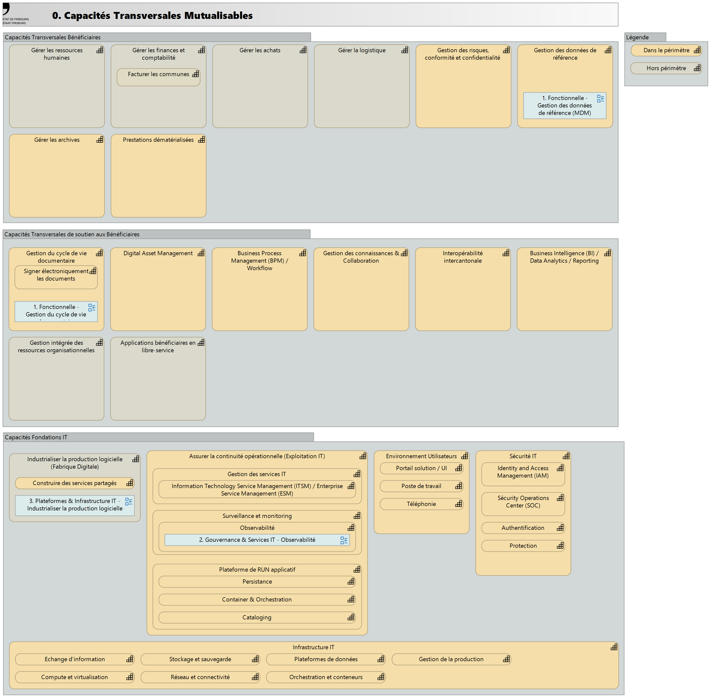

# 0. Capacités Transversales Mutualisables

## Capacités Transversales de soutien aux Bénéficiaires

|Capacité|Intention|
|-|-|
|Orchestrer les processus et dossiers métiers|Exécuter, piloter et suivre les processus métiers transverses impliquant plusieurs acteurs, directions et systèmes d'information. Cette capacité permet aux services bénéficiares de gérer des flux de travail structurés (workflows) et des dossiers complexes (case management) avec traçabilité, gestion des délais et mesure de performance.  Elle couvre l'exécution opérationnelle des processus inter-directions, la gestion des tâches, des validations multi-niveaux et l'intégration avec les systèmes métiers  - Exécuter les workflows structurés et gérer les files de tâches - Gérer les dossiers et instances de cas (case management, états, jalons, décisions) - Appliquer les règles métier automatisées et gérer les escalades - Consulter l'historique complet et garantir la traçabilité des actions - Piloter la performance des processus (tableaux de bord, délais, indicateurs métier)  |
|Maîtriser le cycle de vie des documents|Gérer les documents institutionnels tout au long de leur cycle de vie, de la création à la destruction, en garantissant leur intégrité, traçabilité et conformité légale. Cette capacité couvre la capture, la classification, la validation, la diffusion, la conservation et l'élimination des documents structurés et non structurés, papier et numériques.  Elle s'applique à tous les documents métiers de l'administration cantonale (correspondance, rapports, décisions, procès-verbaux, dossiers) et assure la conformité aux obligations légales (LAr, LPD).  Exclut les archives définitives à valeur patrimoniale (gérées par "Préserver le patrimoine documentaire cantonal").  - Créer, capturer et numériser les documents (production, import, scan) - Classifier, indexer et gérer les métadonnées selon le plan de classement - Valider, versionner et contrôler les accès aux documents - Diffuser et partager les documents de manière contrôlée - Gérer la conservation et l'élimination selon les durées légales|
|Fournir les capacités d'analyse décisionnelle|Collecter, transformer, analyser et restituer les données de l'organisation pour produire des indicateurs, tableaux de bord et analyses au service du pilotage décisionnel des directions et de l'exécutif cantonal. Cette capacité couvre l'extraction de données multi-sources, la création d'entrepôts de données, le reporting standardisé et ad-hoc, l'analyse self-service pour les métiers et l'analytics avancé (descriptif, prédictif, prescriptif). Elle garantit la conformité à la protection des données (anonymisation, pseudonymisation) et s'applique aux besoins de pilotage transverses et inter-directions.   - Extraire et intégrer les données multi-sources (ETL/ELT, data warehouse) - Créer et diffuser des tableaux de bord et indicateurs (KPI, dataviz) - Produire du reporting standardisé et ad-hoc - Fournir l'analyse self-service aux utilisateurs métiers - Réaliser des analytics avancés (statistiques, prédictif, prescriptif, ML)|
|Faciliter la collaboration et l'intelligence collective|Capitaliser, structurer, partager et valoriser les connaissances explicites et tacites de l'organisation cantonale. Cette capacité favorise le travail collaboratif synchrone et asynchrone, le partage d'expertise et l'intelligence collective entre collaborateurs et directions. Elle couvre la gestion des connaissances, les espaces collaboratifs par projet ou communauté de pratique, la coédition documentaire et les outils de communication. S'applique aux besoins de collaboration inter-directions et transverses. Exclut la gestion documentaire institutionnelle formelle (gérée par "Maîtriser le cycle de vie des documents") et l'environnement de travail standard individuel (géré par les Fondations IT).  - Capitaliser et structurer les connaissances (bases de connaissances, wikis, moteur de recherche) - Fournir des espaces collaboratifs par projet ou communauté de pratique - Permettre la coédition et le partage de fichiers en temps réel - Faciliter les échanges synchrones (visioconférence, messagerie instantanée, forums)|
|Centraliser et diffuser les actifs numériques|Centraliser, organiser, enrichir et diffuser les actifs numériques de l'administration cantonale : images, vidéos, fichiers audio, logos, chartes graphiques, publications et contenus multimédias. Cette capacité assure la gestion des droits d'auteur, des métadonnées, des versions et facilite la réutilisation contrôlée des contenus par les directions métiers, les partenaires et les prestataires (agences de communication, imprimeurs). Elle garantit la cohérence de l'identité visuelle cantonale et l'accessibilité des ressources multimédias. Exclut les documents institutionnels textuels (gérés par "Maîtriser le cycle de vie des documents").  - Centraliser et organiser les actifs multimédias (images, vidéos, audio, publications) - Enrichir avec métadonnées, taxonomies et gérer les droits et licences - Rechercher, diffuser et partager les actifs de manière contrôlée - Transformer et adapter les formats selon les usages (web, print, mobile) - Tracer les usages et intégrer avec les outils de publication|
|Unifier la gestion des ressources financières et opérationnelles|Gérer de manière intégrée les ressources financières, matérielles, humaines et logistiques de l'administration cantonale dans un système de gestion unifié (ERP). Cette capacité assure la cohérence des données transactionnelles, les workflows de validation intégrés et le pilotage opérationnel transverse. Elle couvre la gestion financière (comptabilité, budget, immobilisations), la gestion RH et paie (administration du personnel, salaires, assurances sociales), les achats et approvisionnements, les stocks et la logistique. Elle garantit la consolidation multi-entités, la conformité aux standards publics (MCH2, plan comptable cantonal) et l'intégration avec les systèmes métiers spécifiques.  - Gérer les finances intégrées (comptabilité générale, analytique, budgétaire, immobilisations) - Gérer les ressources humaines et la paie (administration du personnel, salaires, assurances) - Gérer les achats, approvisionnements, stocks et inventaires - Exécuter les workflows de validation transverses (engagements, factures, notes de frais) - Consolider et produire le reporting transversal multi-entités|
|Assurer la coopération numérique intercantonale|Échanger des données et des services avec d'autres cantons, la Confédération et les communes dans le respect des standards suisses d'interopérabilité (eCH) et des cadres légaux. Cette capacité couvre l'utilisation des plateformes nationales d'échange sécurisé (sedex, HIN), la gestion des identités fédérées (eID, reconnaissance mutuelle) et la participation aux projets eGovernment Suisse (guichets virtuels communs, prestations intercantonales). Elle garantit la conformité aux normes d'interopérabilité technique, sémantique et organisationnelle du paysage eGov suisse. S'applique aux échanges de données réglementaires (statistiques, registres) et aux prestations communes intercantonales.  - Échanger les données via les plateformes nationales sécurisées (sedex, HIN) - Gérer les identités fédérées et la reconnaissance mutuelle (eID, SwissID) - Assurer la conformité aux standards suisses d'interopérabilité (eCH) - Participer aux projets eGovernment Suisse et prestations communes - Intégrer les échanges avec les systèmes métiers cantonaux|
|Soutenir les besoins métier par des applications légères|Permettre aux directions métiers de créer et déployer rapidement leurs propres applications légères en libre-service (low-code/no-code) pour répondre à des besoins spécifiques. Cette capacité couvre les mini-applications métier (formulaires, portails légers), les automatisations simples, les workflows légers et les tableaux de bord ad-hoc, développés par les collaborateurs métiers eux-mêmes (citizen development).  Elle accélère la digitalisation des processus métiers tout en garantissant la gouvernance, la sécurité et l'intégration avec les systèmes et référentiels cantonaux.  Exclut les processus complexes transverses (gérés par "Orchestrer les processus et dossiers métiers") et l'analyse décisionnelle structurée (gérée par "Fournir les capacités d'analyse décisionnelle").  - Fournir les plateformes low-code/no-code et bibliothèques de composants réutilisables - Créer des mini-applications, automatisations et workflows métier en libre-service - Développer des tableaux de bord et rapports métier ad-hoc - Former, accompagner et gouverner le développement citoyen (standards, validation) - Intégrer avec les systèmes métiers et mutualiser les applications réussies|

## Capacités Fondations IT

|Capacité|Intention|
|-|-|
|Assurer la continuité opérationnelle ("Exploitation IT")|Capacité à assurer le fonctionnement opérationnel continu des systèmes d'information, en garantissant disponibilité, performance et qualité de service.  Couvre la supervision proactive, l'ordonnancement des traitements, la gestion des incidents et demandes, le support aux utilisateurs, et le pilotage de la performance des services IT et métiers. Assure la continuité de service et l'amélioration continue selon les référentiels ITIL/ISO 20000.  Éléments clés - Surveillance et monitoring des infrastructures et applications - Ordonnancement et automatisation des traitements (batch, jobs) - Charte de l'exploitation (procédures, standards, niveaux de service) - Service Desk et support utilisateurs (N1, N2, N3) - Gestion des incidents et résolution des problèmes - Gestion des demandes de service et du catalogue de services - Gestion des changements et releases - Gestion de la disponibilité et de la capacité - Portail self-service pour utilisateurs et métiers - Gestion des niveaux de service (SLA, OLA, monitoring) - Gestion des alertes et escalades automatiques - Plans de continuité et reprise d'activité (PCA/PRA) - Gestion de la performance applicative (APM) - Tableaux de bord opérationnels et reporting - Amélioration continue des processus d'exploitation - Documentation opérationnelle et base de connaissances - Coordination avec les équipes projet et fournisseurs externes|
|Opérer les plateformes d'infrastructure IT ("Infrastructure IT")|Capacité à fournir, maintenir et faire évoluer les infrastructures techniques sous-jacentes nécessaires au fonctionnement des applications et services de l'administration cantonale.  Couvre les couches compute, stockage, réseau, bases de données et plateformes d'orchestration. Assure la disponibilité, la performance, la scalabilité et la résilience des infrastructures on-premise et cloud.  Éléments clés - Gestion des serveurs physiques et virtuels (VM, hyperviseurs) - Orchestration de conteneurs et Kubernetes (AKS, container platforms) - Gestion du stockage (SAN, NAS, stockage objet) - Infrastructure réseau (LAN, WAN, routeurs, switches, load balancers) - Plateformes de bases de données (SQL, Oracle, NoSQL) - Serveurs d'applications (IIS, Tomcat, serveurs web) - Infrastructure d'annuaire (Active Directory, LDAP) - Gestion des environnements (dev, test, préprod, production) - Sauvegarde et restauration (backup & restore) - Gestion de la capacité et dimensionnement - Gestion des configurations d'infrastructure (Infrastructure as Code) - Reverse proxy et équilibrage de charge - Intégration et déploiement continus (CI/CD pipelines) - Gestion des outputs et logs système|
|Fournir l'environnement de travail numérique ("Environnement Utilisateur")|Capacité à fournir aux collaborateurs de l'administration un environnement de travail numérique standardisé, sécurisé et productif. Couvre la fourniture, la configuration et la maintenance des postes de travail (physiques et virtuels), des outils de productivité, de collaboration et de communication. Assure l'accessibilité des services métiers depuis tout type de terminal et garantit une expérience utilisateur optimale.  Éléments clés - Gestion des postes de travail (workstations, laptops) - Virtualisation des applications (VDI, App-V, Citrix) - Distribution et installation des logiciels standards - Services de collaboration et messagerie (email, calendrier, contacts) - Services de communication (téléphonie IP, visioconférence, messagerie instantanée) - Portails et interfaces utilisateur (portails métiers, self-service) - Gestion des périphériques (imprimantes, scanners, écrans) - Support mobilité (smartphones, tablettes, accès distant) - Paramétrage et personnalisation des environnements utilisateurs - Gestion des profils itinérants et données utilisateurs - Distribution automatisée des mises à jour - Conformité et sécurisation des postes (antivirus, chiffrement, politiques de sécurité) - Accessibilité numérique (assistance technologies, ergonomie) - Intégration avec l'IAM (authentification unique, gestion des accès)|
|Sécurité des actifs informationnels ("Sécurité")|Capacité à protéger les systèmes d'information, les données et les infrastructures contre les cybermenaces internes et externes, tout en assurant la conformité aux exigences légales et réglementaires. Couvre la gestion des identités et accès, la protection des réseaux et infrastructures, la détection et réponse aux incidents, la prévention de la perte de données et la sensibilisation des utilisateurs. Garantit les principes de confidentialité, intégrité, disponibilité et traçabilité des actifs informationnels.  Éléments clés - Gestion des identités et des accès (IAM) - Protection périmétrique (firewalls, reverse proxy, filtrage web) - Gestion des vulnérabilités et correctifs de sécurité (patch management) - Sécurisation des infrastructures réseaux (segmentation, VPN, accès distant) - Détection et réponse aux incidents de sécurité (SOC - Security Operations Center) - Protection contre les menaces avancées (Advanced Threat Protection, EDR) - Antivirus et anti-malware - Authentification et provisioning des identités - Gestion des accès privilégiés (PAM) - Chiffrement des données (at rest, in transit) - Prévention de la perte de données (DLP) - Tests d'intrusion et audits de sécurité (pentests, red team) - Gestion des principes de sécurité et politiques (security policies) - Gestion des certificats et PKI - Sécurité des applications (SAST, DAST, secure code review) - Conformité réglementaire (LPD, RGPD, ISO 27001, NIST) - Security awareness et formation des utilisateurs - Gestion de la continuité en cas d'incident de sécurité - Gestion des tiers et fournisseurs (due diligence, contrats)|
|Industrialiser la production logicielle (Fabrique Digitale)|Capacité à industrialiser le cycle de développement, déploiement et exploitation des solutions numériques.  Assure l'automatisation de la chaîne de production logicielle (CI/CD), la gestion des environnements et l'intégration des pratiques DevOps/DevSecOps.  Éléments clés : - Gestion du code source et versioning (Git, SVN) - Intégration continue (CI) et tests automatisés - Déploiement continu et automatisé (CD) - Gestion des pipelines de build et déploiement - Gestion des environnements (dev, test, préprod, prod) - Infrastructure as Code (IaC) - Automatisation des tests (unitaires, intégration, performance, sécurité) - Gestion des artefacts et binaires - Rollback et stratégies de déploiement (blue-green, canary) - Intégration de la sécurité (DevSecOps, SAST/DAST) - Monitoring de la chaîne CI/CD - Gestion des secrets et configurations - Documentation technique automatisée|

## Capacités Transversales Bénéficiaires

|Capacité|Intention|
|-|-|
|Assurer la gestion administrative et le développement du personnel|Piloter l'ensemble du cycle de vie des collaborateurs de l'administration cantonale, du recrutement au départ, en passant par la formation, l'évaluation et la mobilité. Cette capacité assure la gestion administrative du personnel, le développement des compétences et la conformité au statut du personnel cantonal et aux obligations légales (droit du travail suisse, assurances sociales, égalité). Couvre l'ensemble des collaborateurs permanents, temporaires et stagiaires de toutes les directions cantonales.  - Gérer le cycle administratif du personnel (dossiers, contrats, mutations, absences, congés) - Recruter et intégrer les nouveaux collaborateurs (onboarding) - Développer les compétences et gérer les formations continues - Évaluer la performance et accompagner la mobilité interne - Assurer la conformité réglementaire et sociale (salaires, assurances, droit du travail)|
|Piloter les finances publiques cantonales|Planifier, exécuter et contrôler le budget cantonal selon les principes de la comptabilité publique (MCH2) et les obligations légales cantonales et fédérales. Cette capacité couvre la comptabilité générale et analytique, la gestion de trésorerie, le contrôle budgétaire, la consolidation des comptes et le reporting financier. Garantit la transparence financière et la conformité aux normes de gestion des finances publiques suisses. S'applique à l'ensemble des entités et directions cantonales.  - Planifier et suivre l'exécution budgétaire (budget, crédits, reports) - Tenir la comptabilité générale et analytique selon MCH2 - Gérer la trésorerie et les flux financiers (encaissements, paiements) - Contrôler la gestion financière et assurer le pilotage analytique - Clôturer, consolider et produire le reporting financier réglementaire|
|Acquérir les biens et services dans le respect des marchés publics|Planifier, organiser et réaliser les acquisitions de biens et services nécessaires au fonctionnement de l'administration cantonale, dans le strict respect de la législation sur les marchés publics (LMP cantonale, accords OMC/GATT/AELC). Cette capacité couvre l'expression des besoins, les procédures d'appel d'offres, la sélection des fournisseurs, la négociation contractuelle, le suivi des commandes et la gestion de la relation fournisseurs. S'applique à tous les achats dépassant les seuils réglementaires, pour toutes les directions cantonales.  - Analyser les besoins et consulter le marché (sourcing, études de marché) - Conduire les procédures d'appel d'offres conformes (gré à gré, ouvertes, sélectives) - Évaluer, sélectionner les fournisseurs et contractualiser - Gérer les commandes, réceptions et contrôler la conformité - Piloter le référentiel fournisseurs et la performance achats|
|Optimiser les moyens matériels et infrastructures|Gérer les moyens matériels et infrastructures nécessaires au fonctionnement quotidien de l'administration cantonale : espaces de travail (bâtiments, salles), parc mobilier, stocks, fournitures, équipements et logistique événementielle.  Cette capacité assure l'optimisation des ressources physiques, la maintenance préventive et curative, et la conformité aux normes de sécurité et d'accessibilité. Couvre l'ensemble des sites et implantations cantonales, hors infrastructures IT (gérées séparément).  - Gérer les bâtiments, espaces de travail et aménagements - Gérer le parc automobile et les équipements mobiles - Gérer les stocks, approvisionnements et fournitures de bureau - Assurer la maintenance préventive et curative des équipements - Organiser la logistique événementielle et les déménagements|
|Préserver le patrimoine documentaire cantonal|Assurer la conservation à long terme des documents ayant une valeur légale, historique ou patrimoniale, conformément à la législation cantonale sur l'archivage (LAr). Cette capacité couvre l'évaluation archivistique, le versement, le classement scientifique, la conservation pérenne (physique et numérique), la valorisation et la communication des archives publiques aux chercheurs, citoyens et administration. Garantit la pérennité du patrimoine documentaire cantonal et l'accès aux archives selon les délais légaux de protection.  - Évaluer, sélectionner et verser les documents à valeur archivistique - Conserver durablement les archives (supports physiques et numériques) - Classer, décrire et indexer selon les normes archivistiques (ICA, ISAD-G) - Gérer les demandes de consultation et les droits d'accès - Valoriser et numériser le patrimoine archivistique|
|Dématérialiser les prestations aux usagers|Proposer des services publics numériques accessibles en ligne aux citoyens, entreprises et autres usagers de l'administration cantonale. Cette capacité couvre l'ensemble du parcours utilisateur numérique : information, authentification forte, saisie de demande, paiement en ligne, suivi de dossier, notification et archivage probant. Garantit l'accessibilité (WCAG, normes eCH), le multilinguisme (français/allemand minimum) et la conformité aux standards eGovernment suisses (eCH, SwissID). Exclut les processus métiers back-office (orchestrés ailleurs).  - Gérer le catalogue de services en ligne et le guichet virtuel cantonal - Authentifier les usagers et gérer leurs identités numériques (eID, SwissID) - Proposer des formulaires intelligents et gérer les dépôts de demandes - Assurer le suivi de dossier, les notifications et l'espace personnel usager - Garantir l'accessibilité, le multilinguisme et l'archivage probant|
|Maîtriser les risques et assurer la conformité réglementaire|Identifier, évaluer et piloter les risques numériques, informationnels et réglementaires de l'administration cantonale. Cette capacité assure la conformité aux exigences légales en matière de protection des données (LPD, RGPD), de cybersécurité et d'archivage. Elle pilote la gouvernance des risques IT/Data au niveau stratégique et métier, en coordination avec les directions et le comité d'architecture. Exclut l'exploitation technique de la sécurité (gérée par les Fondations IT).  - Identifier et évaluer les risques numériques, cyber et données (cartographie, DPIA) - Assurer la conformité réglementaire (LPD/RGPD, registre des traitements, droits des personnes) - Piloter la gouvernance de la sécurité et des données (politiques, standards, KRI) - Gérer les incidents majeurs et la continuité d'activité (PCA/PRA, gestion de crise) - Sensibiliser les collaborateurs et piloter la culture sécurité|
|Consolider et diffuser les référentiels communs|Identifier, consolider, maintenir et diffuser les données de référence communes à l'ensemble de l'organisation cantonale (personnes physiques et morales, territoires, nomenclatures, référentiels métiers partagés). Cette capacité assure l'unicité, la cohérence et la qualité des données maîtres partagées entre les systèmes et les directions métiers. Garantit que chaque entité de référence dispose d'une "source de vérité" unique et gouvernée.  Exclut les référentiels métiers spécifiques à une seule direction (registre = géré localement).  - Identifier et qualifier les données de référence cantonales (MDM scope) - Consolider et dédoublonner les données maîtres multi-sources - Gérer le cycle de vie des référentiels (création, mise à jour, validation, archivage) - Assurer la qualité des données (règles, contrôles, complétude, conformité) - Distribuer et synchroniser les référentiels vers les systèmes consommateurs|

