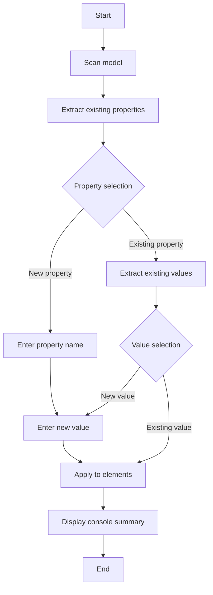

# Assign Property to Selection

## Overview

**Category**: Property Management

**File**: `Tools/assignProperty2Selection.ajs`

**Description**: Assigns or updates a property with its value on all selected elements in the model, choosing from existing properties or creating new properties/values.

---

## Prerequisites

### Required Selection
- [x] Element(s) selected
- [ ] View(s) selected
- [ ] No selection required

### Dependencies
**Libraries**: None

**Configuration**: None

---

## Usage

### Execution Steps
1. Select one or more elements in a view or in the model tree
2. Execute the script from Scripts > Tools > assignProperty2Selection
3. Choose an existing property or create a new property
4. Choose an existing value for this property or enter a new value
5. The property is applied to all selected elements

### Interactions
- **Property selection**: Dropdown list displaying all existing properties in the model, with `<Nouvelle propriété>` option at the top
- **New property input**: Text dialog to enter the name of a new property
- **Value selection**: Dropdown list displaying all existing values for the chosen property, with `<Nouvelle valeur>` option at the top
- **New value input**: Text dialog to enter a new value

---

## Execution Flow



---

## Configuration

Not applicable - This script does not require external configuration.

---

## Output

### Modifications
- **Properties**: Creates or updates the chosen property on all selected elements
- **Created elements**: None
- **Folders**: None

### Console
```
Assign property/value to selection
Propriété 'Status' définie sur 'Active' pour 12 élément(s).
```

### Files
No files generated.

---

## Limitations

- Works only on selected elements (not on views)
- The property is applied uniformly to all selected elements with the same value
- Requires at least one element selected to function

**Supported types**: All ArchiMate element types and diagram objects

---

## Examples

### Mark elements as "Under Review"

**Action**:
1. Select multiple elements in a view (e.g., 5 applications)
2. Execute the script
3. Choose `<Nouvelle propriété>` → Enter "Review Status"
4. Choose `<Nouvelle valeur>` → Enter "Under Review"

**Result**: The 5 applications now have the property "Review Status" = "Under Review"

### Assign existing value to new elements

**Action**:
1. Select 3 new business processes
2. Execute the script
3. Choose the existing property "Criticality"
4. Choose the existing value "High"

**Result**: The 3 processes have the property "Criticality" = "High"

---

## References

**jArchi API**:
- `$(selection)` - Access to selected elements
- `$("archimate-diagram-model")` - Select all views in the model
- `$(theView).find()` - Find elements in a view
- `element.prop()` - Read property names of an element
- `element.prop(name)` - Read property value
- `element.prop(name, value, false)` - Write property (false = no notification)
- `window.promptSelection()` - Selection dialog from a list
- `window.prompt()` - Text input dialog

**Related scripts**:
- [Property - Assign default (selection).ajs](../../../Ville de Lausanne/Property - Assign default (selection).ajs) - Client-specific version for Ville de Lausanne
